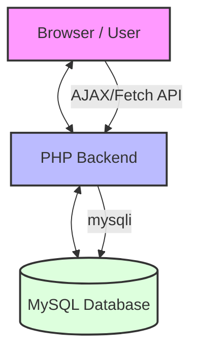
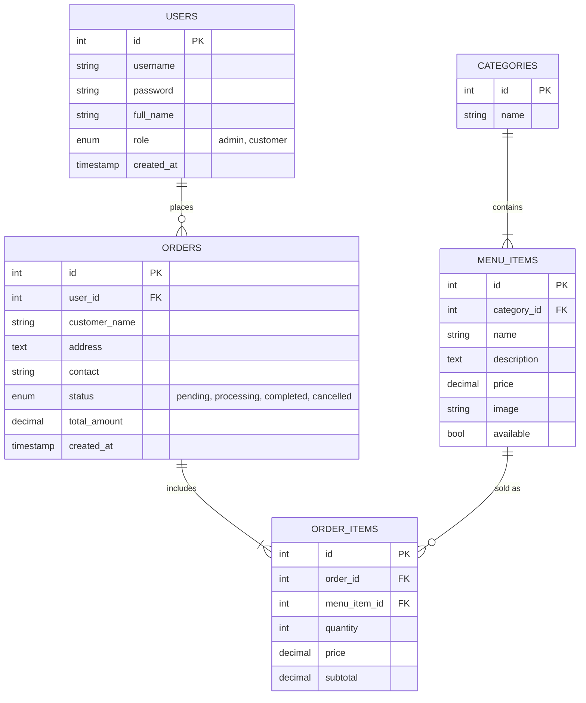
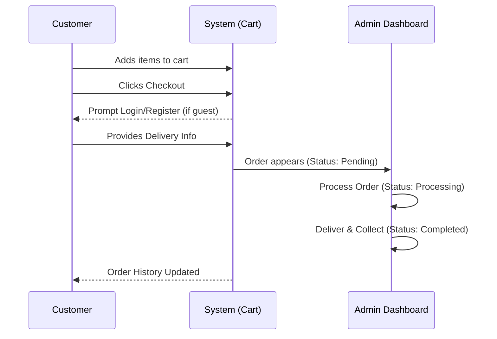

# ☕ Coffee Shop Management System

An artisanal storefront and management system designed for bespoke coffee businesses. This system focuses on high-fidelity user experiences and streamlines inventory and order management with a specialized focus on Cash on Delivery (COD) services.

---

## 🏗️ System Architecture

The system follows a classic LAMP stack pattern with a focus on real-time asynchronous interactions.

---

## 🌟 Key Features

### 🛒 Customer Multi-Item Cart
- **Floating Cart Bar**: A real-time summary of the current order at the bottom of the screen.
- **Dynamic Quantity Control**: Customers can add/remove items and adjust quantities directly from the menu or cart preview.
- **Auth Gate**: Seamless registration and login flow integrated into the checkout process.

### 🛍️ Secure Checkout (COD)
- **Delivery Management**: Captures Full Name, Address, and Contact Number.
- **Input Validation**: Contact numbers are restricted to numerical input with an 11-digit limit.
- **COD Exclusivity**: Designed specifically for regional Cash on Delivery business models.

### 📊 Admin Orchestration
- **Order Lifecycle**: 3-stage status management (`Pending` → `Processing` → `Completed`).
- **Real-Time Dash**: Immediate visibility into customer details and delivery requirements.
- **Sales Analytics**: Daily revenue tracking based on completed order history.

---

## 📊 Database Relations (ERD)

The database consists of 5 core tables managing users, inventory, and sales.

---

## 🔄 Order Lifecycle Flowchart

---

## 🛠️ Getting Started

### Prerequisites
- XAMPP / WAMP / LAMP environment.
- PHP 7.4+ and MySQL.

### Installation
1.  **Clone** this repository to your server's web root.
2.  **Database Configuration**:
    - Create a database named `coffee_shop`.
    - Import `coffee_shop_db.sql` found in the root directory.
    - Configuration is handled in `config/database.php`.
3.  **Access Management**:
    - **Guest/Customer**: Access `index.php` to browse and order.
    - **Admin**: Login via `login.php` with credentials: **admin** / **admin123**.

---

aaaaaa

